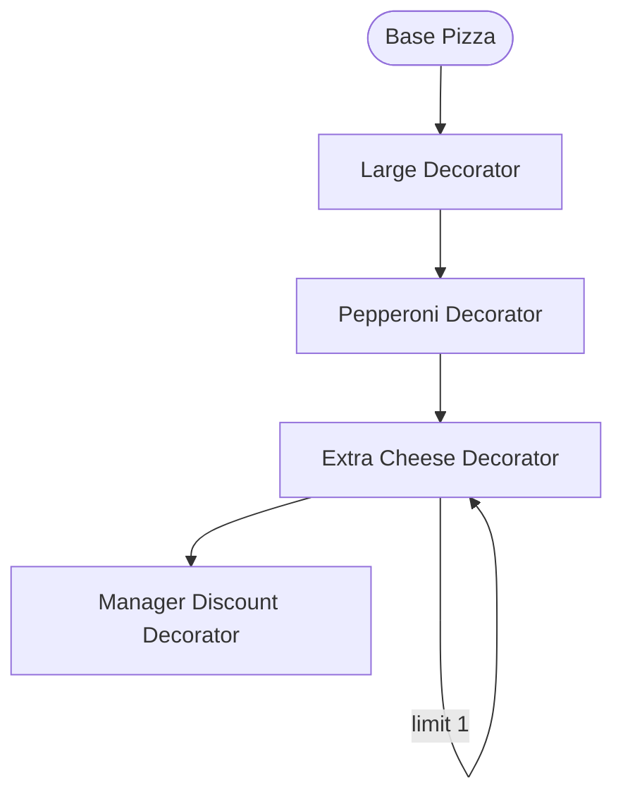
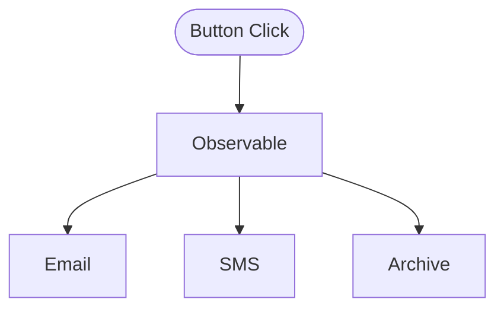
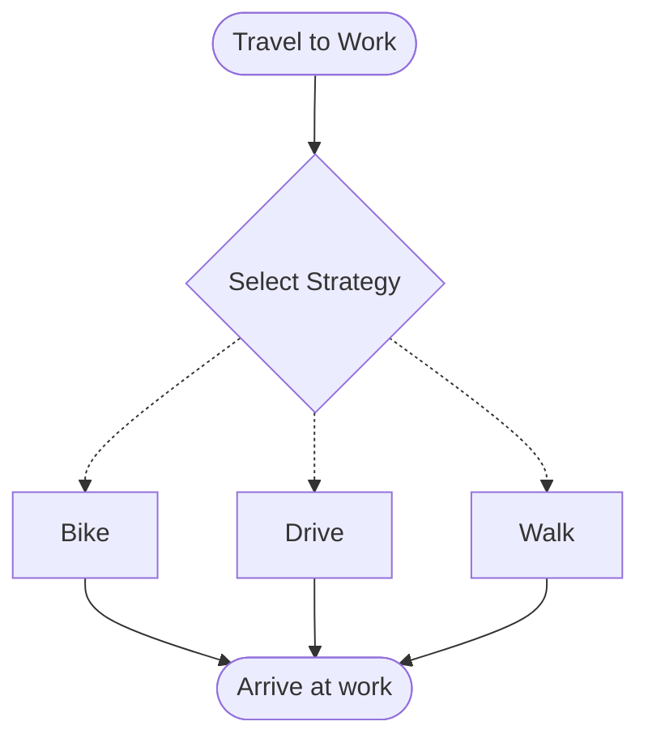
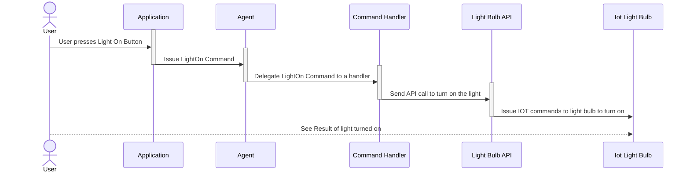

# Practical Design Patterns

Phil DeVeau     
phil@devdevdeveau.net   
https://github.com/devdevdeveau/solution-one

## Why are we talking about this?

- Design Patterns come up frequently in interviews, it's good to have a few in your back pocket for discussion during interviews.

- Many of the solutions that you use or have coded follow the precepts of a named design pattern, it can be useful to understand what benefits and consequences exist without you knowing.

- Strategic thinking and crititcal thinking about solving problems is a good habit.

## Some Well Deserved Criticisms

- The purity of a design pattern does not often match the situations encountered during a developers career. Fitting your problem into rigid boxes can misserve the projects you are working on.

- Many modern programming languages have solved a number of these problems without the need for overly complex solutions.

- The complexities involved in implementation can be difficult for future maintainers. 

## Decorator

Decorators allow for adding functionality to objects at run-time.

### Motivation

Prevent "class explosion" where permutations of functionality must be written to cover a variety of circumstances.

For example, classes that might cover types of `pizza`:

| Class Name |
| - |
| SmallCheesePizza |
| MediumCheesePizza |
| LargeCheesePizza |
| SmallCheesePizzaWithPepperoni |
| MediumCheesePizzaWithPepperoni |
| LargeCheesePizzaWithPepperoni |
| ... |
| LargeCheesePizzaWithLightSauceExtraCheesePepperoniSausageMushroomsGreenPeppers |

Adding any new toppings to our pizza class slugs becomes prohibitely expensive; and if it can't be represented possibly we can't sell it!

```csharp
Pizza pizza = new Pizza();
pizza = new LargePizza(pizza);
pizza = new Pepperoni(pizza);
pizza = new ExtraCheese(pizza);
pizza = new ExtraCheese(pizza);

double calories = pizza.CalculateCalories();

Prep.PrintAssembly(pizza);

pizza = new ManagerDiscount(pizza, 0.15m);
decimal cost = pizza.CalculateCost();

Messaging.SendCost(cost, customer);
```



### Criticisms

- The order of decorators can produce unpredictable results in some scenarios.

- Removing functionality from erroneous operation can present unexpected challenges.

- Expected programming functionality can gain additional complications, think serialization.

### Real World Examples

Point of Sale (POS) systems, for example ordering coffee from a coffee shop; permutations of cream, sugar, syrups, and sizes can be achived with buttons coded to decorate drinks.

## Observer

Observers exist to signal an event to any number of observers.

### Motivation

Signaling to any number of subcribers can be greatly simplified to where the observable object signals to it's observers that work is available to be completed.



### Real World Examples

c# via WinForms uses multi-cast delegates to handle events, each event, when processed calls out to each subscriber to notify of the event to be completed. An examplar button in WinForms doesn't know about the subscribers to the event, or how they might accomplish their work. Instead the event is raised by the button press which will eventually call out to any subscibers.

### Criticisms

- In many scenarios, observables subscribed to an observable represent a potential "memory leak" where modern systems with garbage collection effectively cannot clean up resources because of strong references. 

- Subscribing observers won't be aware of the success or failure of other observers and may produce hard to trace problems. For example, in a theoretical medical device scenario a medical event might have an sms observer to notify a doctor, and archive observer to perist the event; if either observer fails in the task multiple problems could result in a costly law-suit.

## Strategy

Strategies allow for algorithms to evolve separately from their usage.

### Motivation

It can be desireable to disconnect the behavior of a class from the implementation of an algorithm for the class. Consider a simple scenario, traveling from home to work; the time taken and cost can vary differently depending on the method of transportation. Driving a car, riding a bike, walking, jogging, and taking a bus are all valid scenarios for getting you to work; but the time and cost varies for each.



### Real World Examples

There are some common real-world scenarios; reducing switch statements and if/else if/.../else statements. Handling how data might be handled at different times of the day, e.g. an sms alert at night, and an instant message alert during the day.

### Criticisms

- Knowledge of all strategies and when to engage one is required.
- In advanced scenarios with multiple behaviors it's possible that some portions of the implementation will not apply.
- Modern programming languages have simpler methods to handle this with less cognitive load.

## Command

The command pattern seeks to decouple the initiation of a task from the work to perform the task.

### Motivation

A command to turn a light switch on or off could be simply issued; it doesn't matter to the command whether the receiver of the command is a rheostat or a traditional light switch. Many real world scenarios exist where it is very beneficial to decouple the request for work from the work itself.



### Real World Examples

Buying or selling stock is a common example; the actual work for buying the stock is handled by the underlying systems; those systems receive a command to buy or sell. Because of this segregation of responsibility we can change the stock buying handler without impacting the command system. Even if the handler is down, commands can be committed for later processing.

### Criticisms

- Surfacing error messages by command handlers to the command originator creates additional UI/UX challenges.
- Duplicate command handling may be required in certain scenarios.